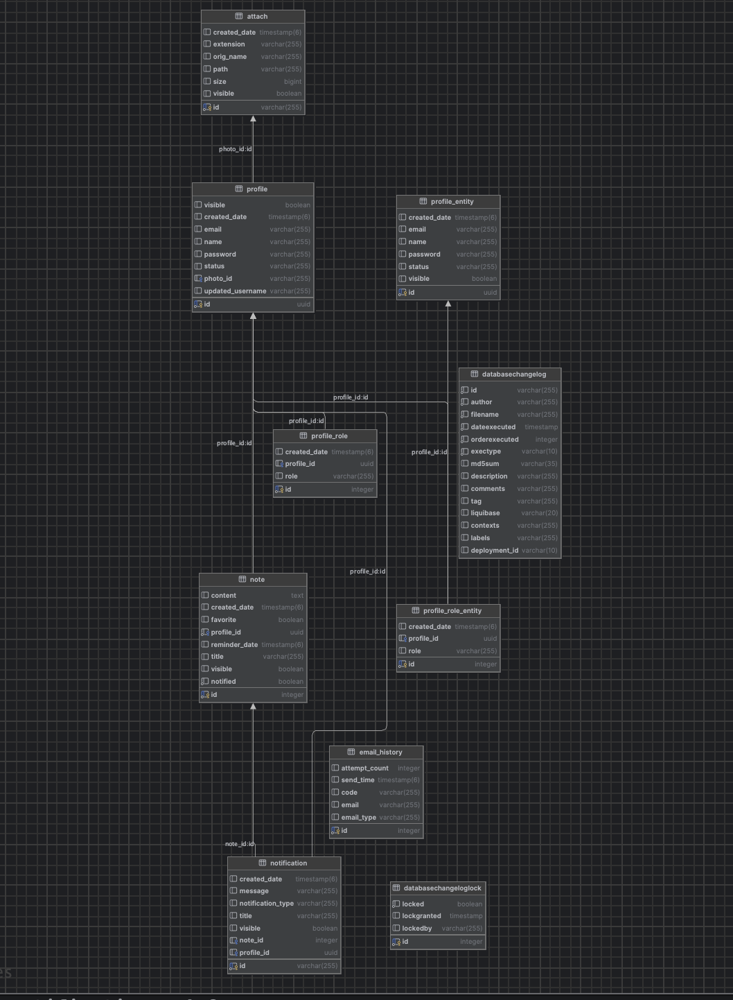

# SmartNotes Backend

SmartNotes is a modern note-taking application. This repository contains the backend of the project, implemented with **Spring Boot**, **Spring Security**, and **JWT-based authentication**. The backend handles user authentication, note management (CRUD operations), favorite notes, email verification, and profile management and notification system.

The backend exposes **RESTful APIs** that the frontend consumes, providing a clean separation of concerns between UI and business logic. While the frontend UI was developed separately, all JavaScript interactions with the backend APIs were implemented to ensure smooth communication and proper data handling.

## Database Overview

The application uses **PostgreSQL** as the main database. It is structured to ensure data normalization, easy maintenance, and scalability. Core tables include:

- `attach` – Stores uploaded files, such as profile images or attachments for notes. Contains file metadata like ID, filename, URL, size, and creation date.

- `profile` – Stores user information such as name, email, hashed password, registration status, and other profile-related data.

- `profile_role` – Associates users with roles (e.g., `ROLE_USER`, `ROLE_ADMIN`) for role-based access control.

- `profile_photo` – Stores profile image references linked to users. Includes file ID, URL, visibility status, and creation date.

- `databasechangelog` – Maintained by **Liquibase** to track database schema changes and applied migrations.

- `note` – Stores notes created by users. Includes title, content, reminder date, creation and update timestamps, and reference to the owner.

- `notification` – Stores notifications for users, including type (e.g., `UNREAD`), message content, related note (if any), and timestamp.

- `email_history` – Logs email-related activities, such as registration verification, password reset, or notifications sent to users.

### Database Structure

**`Base URL`:**
http://localhost:8080/api/v1

**Security**

- JWT-based authentication for all endpoints.
- Role-based access control (ROLE_USER, ROLE_ADMIN).
- Passwords are securely hashed before storing in the database.

**Technologies Used**

- Spring Boot
- Spring Security
- JWT (JSON Web Tokens)
- PostgreSQL
- Liquibase
- Maven
- Lombok

**Project Overview**

- Smart Notes backend handles all server-side operations for the Smart Notes app. It provides authentication, note management, notifications, and profile management for both regular users and admin users.

**Author**

Backend developed by [Nodirjon Okilov].
